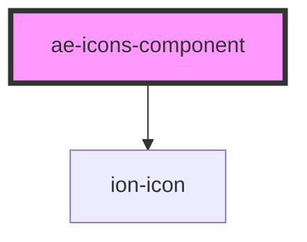

# ae-icons-component

<!-- Auto Generated Below -->

## Properties

| Property    | Attribute   | Description | Type     | Default     |
| ----------- | ----------- | ----------- | -------- | ----------- |
| `aesize`    | `aesize`    |             | `string` | `undefined` |
| `aetype`    | `aetype`    |             | `string` | `undefined` |
| `arialabel` | `arialabel` |             | `string` | `undefined` |
| `color`     | `color`     |             | `string` | `undefined` |
| `name`      | `name`      |             | `string` | `undefined` |

## Dependencies

### Depends on

- ion-icon

### Graph

----------------------------------------------

*Built with [StencilJS](https://stenciljs.com/)*
